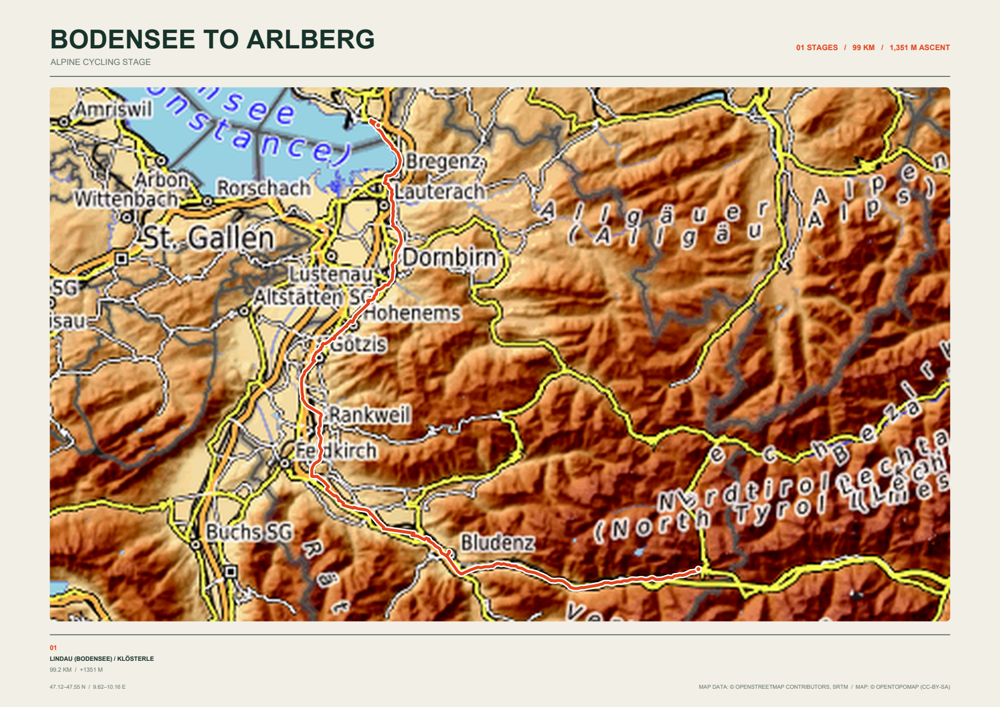
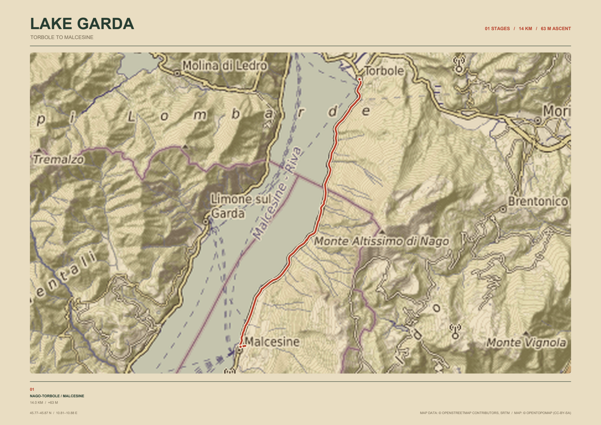
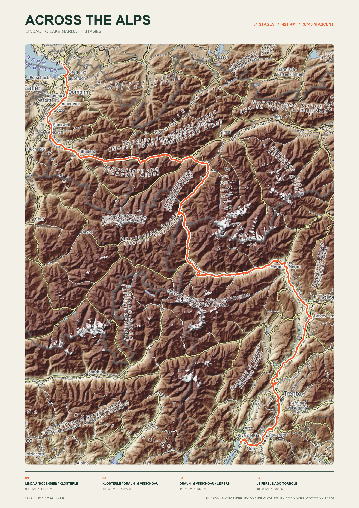
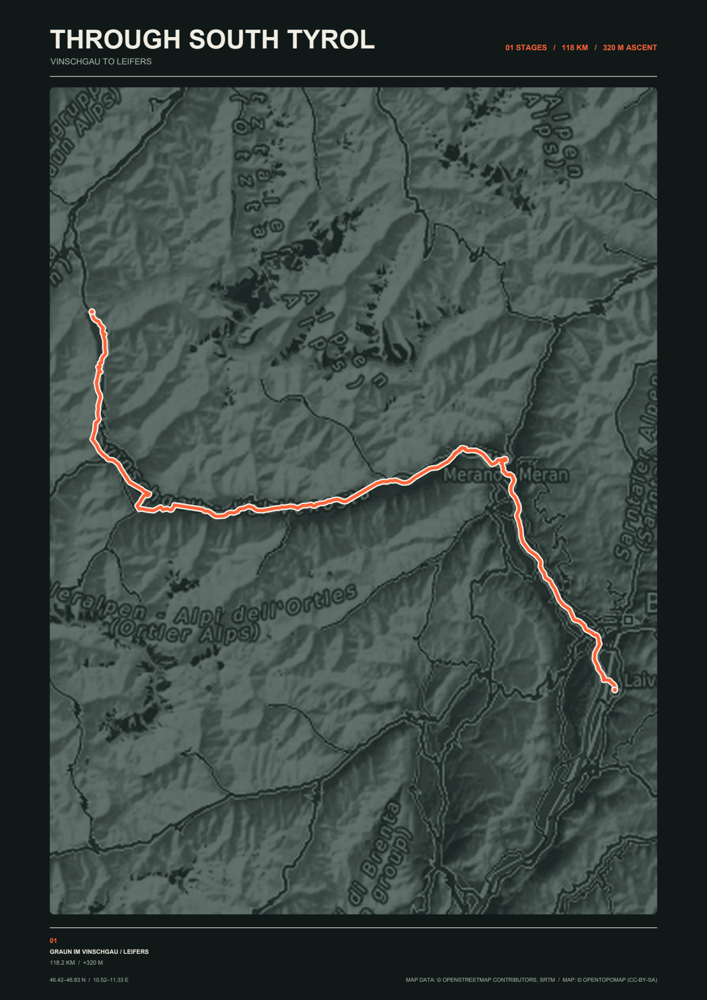

# outdoor-maps-plot

Create print-ready topographic posters from GPX and FIT tracks through a browser
or the command line. Posters contain a real tiled basemap, an emphasized route,
stage distance/ascent statistics, endpoints, coordinates, and provider
attribution.

## Sample posters

These examples were generated from GPX stages between Lake Constance and Lake
Garda using four built-in topographic styles in portrait and landscape layouts.

| | |
|:---:|:---:|
|  |  |
| **Classic Topographic · landscape** | **Vintage Expedition · landscape** |
|  |  |
| **Muted Alpine · portrait** | **Dark Topographic · portrait** |

## Web application

Docker is the simplest way to run the browser interface; it does not require
Python or `uv` on the host:

```shell
docker compose up --build
```

Open <http://localhost:8000>, upload up to 15 GPX or FIT files, configure the
poster, generate a preview, and download PDF, PNG, or JPEG output. Uploaded files
and generated artifacts expire automatically. Map tiles are retained in the
`poster-cache` Docker volume.

The service binds to localhost by default. Configure authentication and a TLS
reverse proxy before deliberately exposing it to a network.

For local web development:

```shell
uv sync
uv run outdoor-maps-web
```

## CLI requirements

- [uv](https://docs.astral.sh/uv/)
- Internet access for the first map render
- GPX track/route files or positioned FIT activity/course files

Install `uv` on Windows with the official standalone installer, then open a new
PowerShell window so the updated `PATH` is loaded:

```powershell
powershell -ExecutionPolicy ByPass -c "irm https://astral.sh/uv/install.ps1 | iex"
uv --version
```

The project pins its complete environment in `uv.lock`; no manual virtual
environment or `pip install` step is needed.

## CLI quick start

Put GPX and/or FIT files in `data/` (they are ignored by Git), then run:

```shell
uv sync
uv run outdoor-maps-plot data \
  --title "Across the Alps" \
  --subtitle "Bodensee to Lake Garda" \
  --paper-size A3 \
  --orientation landscape \
  --style muted-alpine \
  --output output/alps.pdf
```

The input folder is searched recursively. By default, stages are connected into
a north-to-south itinerary using their nearest endpoints. Use
`--route-order input` to retain filename/track order.

## Common options

```text
--paper-size A3             A0-A5, Letter, Legal, Tabloid
--paper-size 300x400mm      Custom WIDTHxHEIGHTmm/cm/in
--orientation landscape     landscape or portrait
--style classic             Color and basemap treatment
--title "Weekend ride"      Poster title
--subtitle "July 2026"      Poster subtitle
--output poster.pdf         .pdf, .png, .jpg
--format png                Explicit format; normalizes the extension
--dpi 300                   PNG/JPEG render resolution
--zoom 10                   Tile zoom level
--padding 6                 Route bounds padding in percent
--route-width 3.5           Route line width in points at A3
--route-color "#2B6CB0"     Override the track color with #RRGGBB
--route-color-mode palette   Give each track a style-matched palette color
--tile-provider esri        Override the style's map provider
```

Run `uv run outdoor-maps-plot --help` for every option,
`--list-styles` for the presets, or `--list-paper-sizes` for named sizes.

### Raster output

The same vector layout is used for every format. PDF remains resolution
independent for text and routes; PNG and JPEG are rasterized at `--dpi`.

```shell
uv run outdoor-maps-plot data -o output/poster.png --paper-size A2 --dpi 300
uv run outdoor-maps-plot data -o output/poster.jpg --jpeg-quality 95
```

## Styles and map providers

Most styles use OpenTopoMap. `esri-topographic`, `stamen-terrain`, and
`thunderforest-outdoors` select their matching providers. Provider selection can
also be overridden with `--tile-provider`.

Stadia and Thunderforest require credentials:

```shell
$env:STADIA_MAPS_API_KEY="..."
$env:THUNDERFOREST_API_KEY="..."
```

Review and comply with the selected tile provider's usage policy. Downloaded
tiles are cached under `.cache/outdoor-maps-plot/`.

## Development

```shell
uv sync --dev
uv run ruff format --check .
uv run ruff check .
uv run pytest
```
