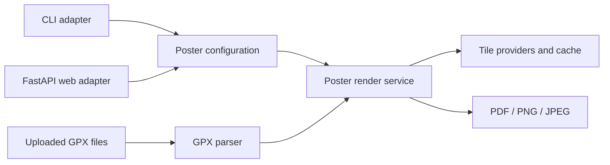
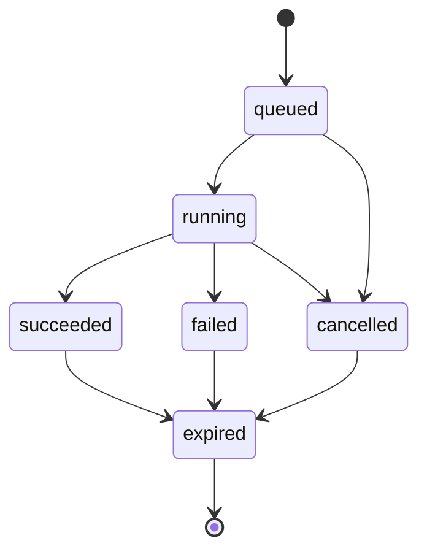

# Web application implementation plan

Status: Proposed  
Target release: `0.2.0` web MVP  
Last updated: 2026-07-30

## 1. Purpose

Convert `outdoor-maps-plot` from a CLI-only program into a self-hosted web
application while preserving the CLI and sharing the same GPX parsing and poster
rendering implementation.

The web application must let a user:

1. Upload one or more GPX files.
2. Inspect the parsed routes and aggregate statistics.
3. Configure every safe, user-relevant poster option.
4. Generate a quick preview.
5. Render a final PDF, PNG, or JPEG poster.
6. Download the result.
7. Delete uploaded and generated data.

This plan targets a trusted, single-instance deployment for one or a few users.
The design leaves clear extension points for a public, multi-user service, but
does not add a database, authentication system, Redis, or object storage to the
MVP.

## 2. Decisions

### 2.1 Selected stack

| Area | Decision |
| --- | --- |
| Backend | FastAPI and Pydantic |
| HTML rendering | Jinja2 |
| Browser interactions | HTMX plus small, framework-free JavaScript |
| Styling | Repository-owned CSS design system |
| Rendering | Existing ReportLab and Pillow implementation |
| PDF rasterization | Replace PyMuPDF with pypdfium2 |
| Job execution | Bounded in-process render queue |
| Production server | Uvicorn, one application process |
| Packaging | Existing `uv` project and lockfile |
| Deployment | Multi-stage Docker image and Docker Compose |
| State | In-memory job metadata and temporary filesystem workspaces |
| Cache | Persistent named volume for downloaded map tiles |

This stack avoids a second JavaScript package manager and a separate frontend
build system. A React or Svelte frontend is not justified for the MVP form and
preview workflow. It can be introduced later if the product grows into an
interactive map editor.

### 2.2 Core architectural rule

The web application must call Python application services directly. It must not
invoke the CLI through a subprocess.

The CLI and web application are adapters around the same validated option model
and render service:



### 2.3 MVP deployment boundary

The MVP runs as one container and one Uvicorn process. A bounded queue executes
no more than two render jobs concurrently by default. This avoids inconsistent
in-memory job state across multiple web processes.

A later multi-instance deployment replaces the in-process queue with a
Redis-backed worker and moves artifacts to object storage. No public API contract
should depend on the queue implementation.

### 2.4 Licensing action

Replace `pymupdf` with `pypdfium2` before publishing the container. PyMuPDF is
offered under GNU AGPL or a commercial license. pypdfium2 is available under
Apache-2.0/BSD-3-Clause and uses the BSD-style licensed PDFium project.

The implementation must retain third-party license notices in the distributed
container and source repository. This is an engineering risk-reduction decision,
not legal advice.

References:

- [FastAPI file uploads](https://fastapi.tiangolo.com/tutorial/request-files/)
- [FastAPI background-task guidance](https://fastapi.tiangolo.com/tutorial/background-tasks/)
- [uv Docker integration](https://docs.astral.sh/uv/guides/integration/docker/)
- [PyMuPDF licensing](https://pymupdf.readthedocs.io/en/latest/faq/index.html)
- [pypdfium2 licensing](https://pypdfium2.readthedocs.io/en/stable/readme.html#licensing)

## 3. Scope

### 3.1 MVP features

- Multiple `.gpx` files per upload.
- Drag-and-drop and file-picker input.
- GPX validation and route summary before rendering.
- All safe poster options exposed in the UI.
- Low-resolution PNG preview.
- Final PDF, PNG, or JPEG generation.
- Render progress and human-readable errors.
- Download and explicit deletion.
- Automatic expiration of uploads and results.
- OpenTopoMap and configured credential-based providers.
- Persistent tile caching.
- Responsive, keyboard-accessible UI.
- CLI behavior retained.
- Container health endpoint.

### 3.2 Explicit non-goals

- User accounts and authentication.
- Public internet hardening beyond the documented baseline.
- Persistent render history.
- Sharing links.
- Payments or quotas per user.
- ZIP uploads.
- GPX editing.
- Interactive route geometry editing.
- Arbitrary tile-server URLs.
- Custom fonts, colors, or user-provided style definitions.
- Distributed workers or multiple web replicas.
- Mobile-native application.

### 3.3 Public-service follow-up

Before exposing the service directly to the public internet, add:

- Authentication and authorization.
- Per-user quotas and rate limiting.
- Redis-backed durable jobs.
- Separate render workers.
- Database-backed metadata.
- Object storage with expiring download URLs.
- Malware scanning and stronger content inspection.
- Abuse controls for tile-provider consumption.
- Centralized observability and alerting.

## 4. Proposed package structure

Retain the existing package and introduce web modules without a large directory
move in the first phase:

```text
src/outdoor_maps_plot/
├── __init__.py
├── __main__.py
├── cli.py
├── gpx.py
├── options.py              # Shared validated configuration
├── poster.py
├── service.py              # Render use case and progress contract
├── styles.py
└── web/
    ├── __init__.py
    ├── app.py              # Application factory and middleware
    ├── api.py              # HTTP routes
    ├── config.py           # Environment-backed server settings
    ├── errors.py           # HTTP-safe error mapping
    ├── jobs.py             # Queue, job state, cancellation
    ├── schemas.py          # Upload/render response models
    ├── storage.py          # Workspace and expiration lifecycle
    ├── templates/
    │   ├── index.html
    │   └── partials/
    │       ├── options.html
    │       ├── progress.html
    │       ├── result.html
    │       └── upload-summary.html
    └── static/
        ├── app.css
        ├── app.js
        └── vendor/
            └── htmx.min.js

tests/
├── unit/
├── web/
├── integration/
└── fixtures/

Dockerfile
compose.yaml
.dockerignore
```

`htmx.min.js` is vendored so the application does not require a public CDN at
runtime. Its version and license must be recorded.

## 5. Shared domain contracts

### 5.1 Poster configuration

Replace the `PosterOptions` dataclass with a Pydantic `PosterConfig`. It remains
independent of FastAPI so the CLI can use it without importing the web package.

The initial normalized model is flat to minimize migration risk:

| Field | Type and bounds | Default | UI |
| --- | --- | --- | --- |
| `title` | string, 1–120 characters | `My GPX Adventure` | Text |
| `subtitle` | string, 0–200 characters | empty | Text |
| `paper_size` | named size or validated custom size | `A3` | Select/custom |
| `orientation` | `portrait` or `landscape` | `landscape` | Segmented control |
| `style_name` | known style identifier | `classic` | Style cards |
| `provider` | known provider or null | null | Advanced select |
| `zoom` | integer, 0–19 plus provider limit | 10 | Slider/number |
| `padding_percent` | number, 0–50 | 6 | Slider/number |
| `margin_mm` | number, 1–50 | 14.8 | Number |
| `basemap_width` | integer, 512–10,000 | 2,400 | Advanced number |
| `max_tiles` | integer, 1–server limit | 200 | Advanced number |
| `simplify_points` | number, 0–10 | 0.35 | Advanced number |
| `route_width` | number, 0.5–20 | 3.5 | Number |
| `route_order` | `auto` or `input` | `auto` | Select |
| `output_format` | `pdf`, `png`, or `jpeg` | `pdf` | Segmented control |
| `dpi` | integer, 72–1,200 | 300 | Conditional number |
| `jpeg_quality` | integer, 1–100 | 92 | Conditional number |

The web UI exposes `max_tiles` but the server always caps it at the configured
server maximum. The UI does not expose filesystem paths, cache paths, output
paths, API keys, or arbitrary provider URLs.

Pydantic field descriptions and JSON-schema metadata must include:

- Display label.
- Group.
- Units, where applicable.
- Advanced/basic designation.
- Choices.
- Minimum and maximum.
- Help text.

The UI remains deliberately composed rather than blindly generated from JSON
Schema, but `/api/config` uses this metadata so choices and limits cannot drift
from backend validation.

### 5.2 Render service

Introduce an application service with no HTTP dependency:

```python
def render_poster(
    routes: list[Route],
    destination: Path,
    cache: Path,
    config: PosterConfig,
    progress: ProgressReporter | None = None,
    cancellation: CancellationToken | None = None,
) -> RenderResult:
    ...
```

The service owns:

- Configuration validation.
- Page and output resolution.
- Basemap preparation.
- Poster creation.
- Raster conversion.
- Progress reporting.
- Cancellation checks.
- Final artifact metadata.

The CLI maps argparse values into `PosterConfig` and calls this service.

### 5.3 Progress contract

Use stable phases rather than exposing internal function names:

| Phase | Approximate range |
| --- | ---: |
| `validating` | 0–5% |
| `parsing` | 5–15% |
| `fetching_map` | 15–55% |
| `drawing` | 55–85% |
| `rasterizing` | 85–95% |
| `finalizing` | 95–100% |

Progress events contain:

```json
{
  "phase": "fetching_map",
  "percent": 37,
  "message": "Preparing topographic map",
  "updated_at": "2026-07-30T12:00:00Z"
}
```

Messages must not expose local paths, provider API keys, raw URLs containing
keys, or route coordinates.

## 6. Upload lifecycle

### 6.1 Defaults

All limits are configurable through environment variables, with these defaults:

| Limit | Default |
| --- | ---: |
| Files per upload | 20 |
| Individual file size | 25 MiB |
| Total upload size | 100 MiB |
| Parsed points per upload | 1,000,000 |
| Upload/result lifetime | 60 minutes |
| Concurrent render jobs | 2 |
| Queued jobs | 10 |
| Server-enforced map-tile limit | 500 |

### 6.2 Validation

- Stream each `UploadFile` into the job workspace.
- Do not trust the supplied filename or MIME type.
- Generate server-side filenames.
- Require a `.gpx` suffix for user feedback, then validate XML content.
- Require a GPX root element and at least one usable track or route.
- Reject files exceeding individual, aggregate, and point-count limits.
- Use `defusedxml` rather than the standard XML parser.
- Do not support archives in the MVP.
- Return all per-file validation errors when possible.

### 6.3 Workspace layout

Use cryptographically random identifiers, not sequential IDs:

```text
/tmp/poster-jobs/
└── <upload-id>/
    ├── input/
    │   ├── 001.gpx
    │   └── 002.gpx
    ├── preview/
    └── renders/
        └── <job-id>/
```

The original filenames exist only as sanitized display metadata in memory. They
are never used as filesystem paths.

The cleanup service removes expired workspaces. Explicit deletion removes the
workspace as soon as no render is active. Deletion uses resolved-path checks and
must never operate outside the configured job root.

## 7. HTTP API

All error responses use:

```json
{
  "error": {
    "code": "invalid_gpx",
    "message": "One GPX file could not be parsed.",
    "details": []
  }
}
```

Internal exceptions and paths are logged server-side and are not returned to the
browser.

### 7.1 Configuration

#### `GET /api/config`

Returns:

- Poster defaults and validation metadata.
- Named paper sizes.
- Style labels, colors, and default providers.
- Available providers and whether credentials are configured.
- Upload and server resource limits.
- Supported output formats.

It never returns provider credentials.

### 7.2 Uploads

#### `POST /api/uploads`

Content type: `multipart/form-data`  
Field: repeated `files`

Response: `201 Created`

```json
{
  "upload_id": "opaque-token",
  "files": [
    {
      "display_name": "stage-1.gpx",
      "size_bytes": 123456,
      "route_count": 1
    }
  ],
  "summary": {
    "route_count": 4,
    "point_count": 182000,
    "distance_km": 492.8,
    "ascent_m": 4542
  },
  "routes": [
    {
      "name": "Stage 1",
      "distance_km": 102.3,
      "ascent_m": 1260
    }
  ],
  "expires_at": "2026-07-30T13:00:00Z"
}
```

#### `GET /api/uploads/{upload_id}`

Returns the upload summary without route coordinates.

#### `DELETE /api/uploads/{upload_id}`

Cancels queued work where possible and removes the upload when safe.

### 7.3 Rendering

#### `POST /api/renders`

```json
{
  "upload_id": "opaque-token",
  "mode": "preview",
  "config": {
    "title": "Across the Alps",
    "paper_size": "A3",
    "orientation": "landscape",
    "style_name": "muted-alpine",
    "output_format": "pdf"
  }
}
```

`mode` is `preview` or `final`.

Preview mode enforces server-selected limits:

- PNG output.
- 96 DPI.
- Basemap width no greater than 1,200 pixels.
- Lower tile ceiling.
- Preview watermark is optional and off by default.

Final mode respects validated output settings.

Response: `202 Accepted`

```json
{
  "job_id": "opaque-token",
  "status": "queued",
  "status_url": "/api/renders/opaque-token",
  "events_url": "/api/renders/opaque-token/events"
}
```

#### `GET /api/renders/{job_id}`

Returns job status, progress, error, expiration, and download metadata.

#### `GET /api/renders/{job_id}/events`

Server-Sent Events stream for progress. A small browser script updates the HTMX
progress partial. Polling `GET /api/renders/{job_id}` remains the fallback.

#### `GET /api/renders/{job_id}/download`

Available only after success. Uses `Content-Disposition: attachment` with a
server-generated filename and the correct media type.

#### `DELETE /api/renders/{job_id}`

Requests cancellation and deletes completed output.

### 7.4 Operational endpoints

- `GET /healthz`: process is alive.
- `GET /readyz`: job root and cache are writable and the queue accepts work.

These endpoints do not test external tile providers.

## 8. Job model

### 8.1 States



Each job stores:

- Opaque job ID.
- Upload ID.
- Mode.
- Validated configuration snapshot.
- State.
- Progress event.
- Created, started, finished, and expiry timestamps.
- Artifact media type, size, and internal path after success.
- Safe error code/message after failure.
- Cancellation token.

### 8.2 Queue behavior

- Reject new renders with `429 Too Many Requests` when the queue is full.
- A user may queue multiple renders for one upload within global limits.
- Preview requests with the same upload and normalized configuration may reuse a
  non-expired result.
- Final renders do not silently reuse an artifact unless the full normalized
  configuration and renderer version match.
- Cancellation is cooperative between render phases and tile downloads.
- On process restart, in-memory jobs disappear and temporary workspaces are
  cleaned by age.

### 8.3 Progress delivery

SSE is the primary experience. The frontend reconnects with backoff and falls
back to polling every two seconds. The render continues if the browser
disconnects.

## 9. Web user interface

### 9.1 Main flow

The application is a responsive single-page workflow:

```text
┌───────────────────────────────────────────────────────────┐
│ Outdoor Maps Plot                                        │
├───────────────────────────────────────────────────────────┤
│ 1. Drop GPX files                                        │
│    [ Drop files or browse ]                              │
├───────────────────────────────┬───────────────────────────┤
│ 2. Poster options             │ 3. Preview               │
│ Title                         │                           │
│ Paper  [A3] [Landscape]       │     poster thumbnail      │
│ Style cards                   │                           │
│ Route and output controls     │ [Refresh preview]         │
│ Advanced options              │                           │
├───────────────────────────────┴───────────────────────────┤
│ [Generate final poster]  Progress…  [Download]           │
└───────────────────────────────────────────────────────────┘
```

On narrow screens, the options and preview columns stack.

### 9.2 Upload experience

- Drag/drop target and keyboard-accessible file picker.
- Multiple files.
- Per-file size/status.
- Clear all and remove-before-upload actions.
- Aggregate route summary after upload.
- Inline validation messages.
- Notice that rendering requests map tiles and therefore reveals the selected
  geographic tile area to the chosen provider.

### 9.3 Options

- Basic options visible immediately.
- Advanced options in a disclosure panel.
- Portrait/landscape segmented control updates the CSS poster outline.
- Paper selection updates the preview aspect ratio.
- Style cards show name, paper color, ink color, and route color.
- Provider controls show whether required credentials are configured.
- DPI appears only for PNG/JPEG.
- JPEG quality appears only for JPEG.
- Validation errors appear next to their fields and in a summary.
- Reset-to-default action.

### 9.4 Preview and result

- Debounce preview requests; never render on every keystroke.
- Explicit “Refresh preview” remains available.
- Show current phase, percentage, and cancel action.
- Preserve configuration after an error.
- Show output filename, format, dimensions, and size on success.
- Download action is prominent.
- A new final render does not delete the previous successful download until the
  replacement succeeds or expires.

### 9.5 Accessibility

- Meet WCAG 2.2 AA color contrast for application controls.
- Every input has a programmatic label.
- All actions work by keyboard.
- Focus moves to upload or render errors.
- Progress changes use an appropriate live region without excessive
  announcements.
- Respect `prefers-reduced-motion`.
- Style selection does not rely on color alone.

## 10. Security and privacy

### 10.1 Required controls

- `defusedxml` for untrusted GPX XML.
- Upload byte and point limits enforced server-side.
- Generated path names only.
- Resolved-path containment checks before deletion and download.
- Fixed tile-provider URL templates; no user-provided URLs.
- Provider keys only from environment variables or container secrets.
- API keys redacted from logs and exceptions.
- Non-root container user.
- No directory listings.
- Security response headers.
- Same-origin checks and CSRF tokens for browser mutation requests.
- `HttpOnly`, `SameSite=Strict` session cookie only if a session cookie becomes
  necessary.
- Strict accepted methods and content types.
- Queue and concurrency limits.
- Request timeouts at the reverse proxy.
- No GPX coordinates, filenames, titles, or subtitles in normal request logs.

### 10.2 Privacy behavior

- Uploads and outputs are temporary by default.
- No analytics or third-party browser assets in the MVP.
- The UI discloses that geographic tile requests go to the selected provider.
- A future offline/self-hosted tile provider is an extension, not part of MVP.
- Server operators are responsible for provider terms and credentials.

### 10.3 Threat-focused tests

- XML entity expansion and malformed XML.
- Oversized multipart upload.
- Excessive file count and point count.
- Filename traversal attempts.
- Invalid upload/job identifiers.
- Download path manipulation.
- Provider-key redaction.
- Queue exhaustion.
- Deletion containment.
- Expired object access.

## 11. Docker and configuration

### 11.1 Dockerfile

Use a multi-stage build:

1. Start from `python:3.13-slim`.
2. Copy a pinned `uv` binary from an official `ghcr.io/astral-sh/uv` image.
3. Copy `pyproject.toml` and `uv.lock`.
4. Run `uv sync --locked --no-dev --no-install-project`.
5. Copy application source.
6. Run `uv sync --locked --no-dev --no-editable`.
7. Copy only the application and virtual environment to the runtime stage.
8. Create and switch to a non-root application user.
9. Put `/app/.venv/bin` on `PATH`.
10. Start one Uvicorn process.

Pin the base images and `uv` version. Record image digests when preparing a
release.

### 11.2 Compose topology

```yaml
services:
  app:
    build: .
    ports:
      - "127.0.0.1:8000:8000"
    volumes:
      - poster-cache:/var/cache/outdoor-maps-plot
    tmpfs:
      - /tmp/poster-jobs
    restart: unless-stopped

volumes:
  poster-cache:
```

Bind to localhost by default. Operators deliberately change the binding or put a
TLS reverse proxy in front of the application for network access.

### 11.3 Environment variables

| Variable | Purpose |
| --- | --- |
| `OMP_HOST` | Bind address |
| `OMP_PORT` | HTTP port |
| `OMP_JOB_ROOT` | Temporary workspace root |
| `OMP_CACHE_ROOT` | Persistent tile cache |
| `OMP_JOB_TTL_SECONDS` | Upload/result lifetime |
| `OMP_MAX_FILES` | Files per upload |
| `OMP_MAX_FILE_BYTES` | Individual file limit |
| `OMP_MAX_UPLOAD_BYTES` | Aggregate limit |
| `OMP_MAX_POINTS` | Aggregate parsed point limit |
| `OMP_MAX_QUEUED_JOBS` | Queue limit |
| `OMP_MAX_CONCURRENT_JOBS` | Worker concurrency |
| `OMP_MAX_TILES` | Hard provider-tile ceiling |
| `STADIA_MAPS_API_KEY` | Optional Stadia credential |
| `THUNDERFOREST_API_KEY` | Optional Thunderforest credential |

Configuration is parsed and validated once during application startup.

## 12. Testing strategy

### 12.1 Unit tests

- `PosterConfig` validation and JSON-schema metadata.
- CLI-to-config mapping.
- GPX parsing limits and safe XML behavior.
- pypdfium2 raster output.
- Progress phase ordering.
- Cancellation.
- Workspace path containment and expiration.
- Job-state transitions.

### 12.2 Web tests

Use FastAPI’s test client with injected fake render and tile services:

- Configuration endpoint.
- Valid multi-file upload.
- Partial and complete validation failures.
- Preview and final render creation.
- Progress/status responses.
- Download headers and content type.
- Cancellation and deletion.
- Queue-full response.
- Expired upload and render behavior.
- CSRF/same-origin enforcement.

### 12.3 Render integration tests

- Offline synthetic basemap.
- Representative GPX fixtures.
- PDF, PNG, and JPEG signatures.
- Portrait and landscape dimensions.
- Named and custom page sizes.
- Every built-in style.
- Preview override limits.
- CLI regression test.

Tests must not call real tile-provider services.

### 12.4 Browser tests

Use Playwright through the Python development environment for a small critical
suite:

1. Upload GPX files.
2. View parsed summary.
3. Change orientation, style, and output format.
4. Generate preview.
5. Generate and download final output.
6. Verify keyboard navigation and visible error behavior.

### 12.5 Container tests

- Image builds from a clean checkout.
- Container starts without a host Python or `uv`.
- `/healthz` and `/readyz` succeed.
- Application runs as non-root.
- Tile cache persists across restart.
- Job workspace does not persist across restart.
- Locked dependency installation succeeds.

## 13. Delivery phases and acceptance criteria

### Phase 0: contracts and skeleton

Deliver:

- `PosterConfig`.
- Render-service interface.
- Progress and cancellation protocols.
- Web package skeleton.
- Updated dependency/license decision.

Accept when:

- Existing CLI behavior and tests still pass.
- CLI uses the shared configuration model.
- No web module imports argparse.
- No core module imports FastAPI.

### Phase 1: safe core

Deliver:

- pypdfium2 rasterization.
- `defusedxml`.
- Point-count limit.
- Progress and cancellation instrumentation.

Accept when:

- PDF, PNG, and JPEG tests pass.
- Malicious XML fixture is rejected safely.
- Current real GPX data still parses.
- PyMuPDF is absent from the lockfile.

### Phase 2: web vertical slice

Deliver:

- Application factory.
- Configuration and health endpoints.
- GPX upload and summary.
- In-process queue.
- Preview/final render, status, download, delete.
- Expiration cleanup.

Accept when:

- A test client can upload GPX, queue a render, and download output.
- Limits and path-containment tests pass.
- No real network is required by tests.

### Phase 3: polished UI

Deliver:

- Responsive upload workflow.
- Route summary.
- Complete basic and advanced option controls.
- Style/orientation/paper visualization.
- Preview, progress, cancellation, result, and download.
- Accessibility behavior.

Accept when:

- Every `PosterConfig` field is represented or deliberately server-controlled.
- Critical Playwright flow passes.
- UI works without third-party runtime CDNs.
- Mobile and desktop layouts are usable.

### Phase 4: container and operations

Deliver:

- Dockerfile.
- Compose configuration.
- `.dockerignore`.
- Environment reference.
- Container and deployment documentation.

Accept when:

- `docker compose up --build` starts the service.
- The complete workflow works without host Python or `uv`.
- Container runs as non-root.
- Health checks and volumes behave as documented.

### Phase 5: release readiness

Deliver:

- Full regression suite.
- Third-party license notices.
- Security review checklist.
- Updated README and changelog.
- Release/version update.

Accept when:

- Formatting, linting, unit, integration, browser, and container tests pass.
- No secrets or GPX files are tracked.
- Provider attribution appears in every output.
- Uploads and outputs expire as configured.
- Known limitations are documented.

## 14. Parallel agent work plan

Parallel work starts only after the primary agent lands the Phase 0 contracts and
package skeleton. Agents share the workspace, so file ownership is strict.

### Agent A: core renderer

Owns:

- `src/outdoor_maps_plot/options.py`
- `src/outdoor_maps_plot/gpx.py`
- `src/outdoor_maps_plot/poster.py`
- `src/outdoor_maps_plot/service.py`
- Core unit tests

Tasks:

- Shared configuration model.
- CLI-compatible render service.
- pypdfium2 migration.
- Safe XML parser and limits.
- Progress/cancellation hooks.

Must not edit:

- Web package.
- Docker/Compose.
- `pyproject.toml` or `uv.lock`; dependency changes are requested from the
  primary agent.

### Agent B: web backend

Owns:

- `src/outdoor_maps_plot/web/app.py`
- `src/outdoor_maps_plot/web/api.py`
- `src/outdoor_maps_plot/web/config.py`
- `src/outdoor_maps_plot/web/errors.py`
- `src/outdoor_maps_plot/web/jobs.py`
- `src/outdoor_maps_plot/web/schemas.py`
- `src/outdoor_maps_plot/web/storage.py`
- Web API tests

Tasks:

- Upload lifecycle.
- Job queue and state transitions.
- API endpoints and SSE.
- Cleanup, limits, and safe errors.
- Health/readiness.

Must use the Phase 0 service interface and must not edit core rendering modules.

### Agent C: web UI

Owns:

- `src/outdoor_maps_plot/web/templates/`
- `src/outdoor_maps_plot/web/static/`
- UI-focused browser tests

Tasks:

- Upload interaction.
- Options UI.
- Style and page visualization.
- Preview/progress/result workflow.
- Responsive and accessible styling.

Must use the documented API responses and must not add alternative API
endpoints.

### Primary agent: architecture and integration

Owns:

- `pyproject.toml`
- `uv.lock`
- `src/outdoor_maps_plot/cli.py`
- Dockerfile, Compose, and `.dockerignore`
- Repository documentation
- Integration and container tests
- Final conflict resolution

Tasks:

- Land contracts before delegation.
- Coordinate dependency changes.
- Integrate agent work in phase order.
- Review security and licensing.
- Run complete validation.

### Integration sequence

1. Primary agent completes Phase 0.
2. Agents A, B, and C work in parallel against fixed contracts.
3. Agent A completes the real render service.
4. Agent B replaces its render fake with the real service.
5. Agent C runs its workflow against the integrated backend.
6. Primary agent adds containerization and end-to-end verification.

An agent must message the primary agent rather than modifying a file outside its
ownership area.

## 15. Definition of done

The web MVP is done when a new user can:

1. Clone the repository.
2. Run `docker compose up --build`.
3. Open `http://localhost:8000`.
4. Upload multiple GPX files.
5. Review route statistics.
6. Configure every exposed option, including portrait/landscape.
7. Generate a preview.
8. Generate and download PDF, PNG, and JPEG outputs.
9. Delete the job.

Additionally:

- The CLI remains functional and documented.
- No host Python, `uv`, or Node.js is required for container usage.
- All automated checks pass without external tile requests.
- Upload and render limits are enforced.
- Temporary data expires.
- The tile cache persists.
- The container runs as non-root.
- Provider credentials never reach the browser or logs.
- Third-party licenses and map attribution are present.

## 16. Assumptions requiring confirmation before implementation

The plan proceeds with these defaults unless requirements change:

1. The MVP is self-hosted and binds to localhost.
2. It has no application-level login.
3. Uploaded GPX data and outputs expire after 60 minutes.
4. Up to two renders may run concurrently.
5. Map tiles come from the currently supported external providers.
6. ZIP upload and persistent project history are deferred.
7. English is the only UI language in the MVP.

The most consequential future decision is whether the application will be
publicly internet-facing. If yes, authentication, durable jobs, rate limiting,
and persistent storage move into the initial implementation rather than a later
phase.
